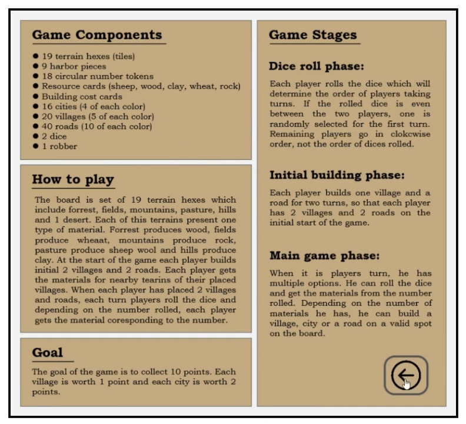
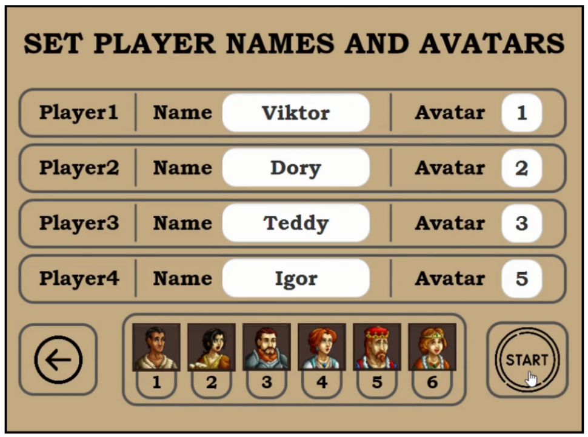
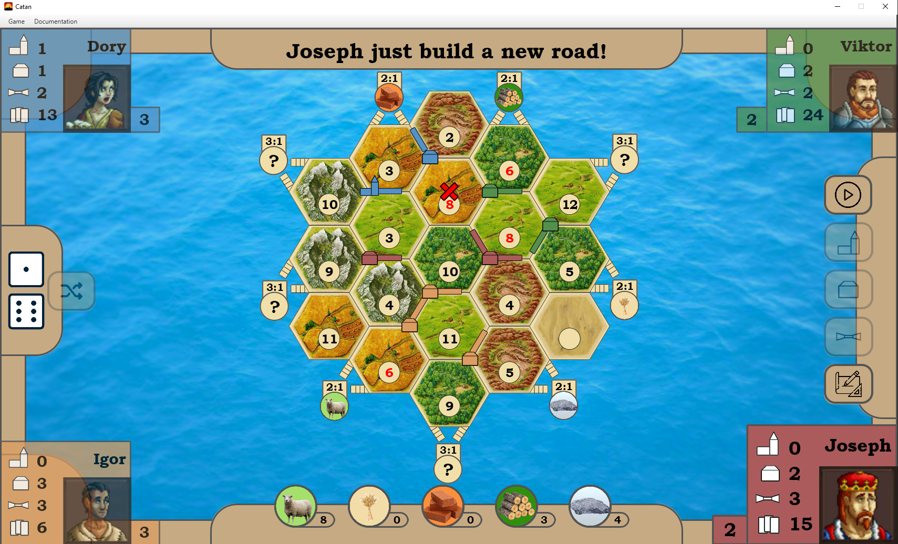
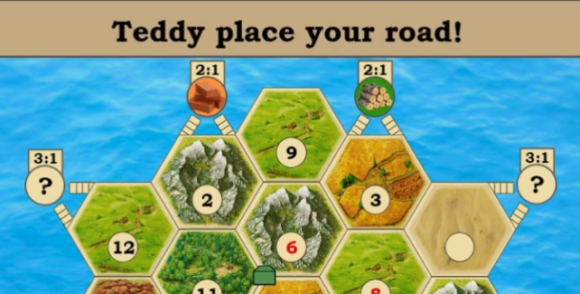
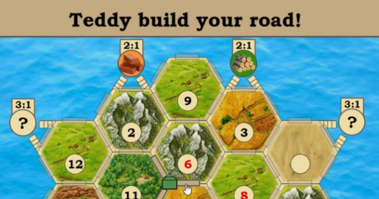
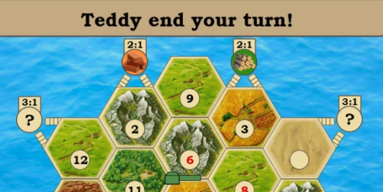
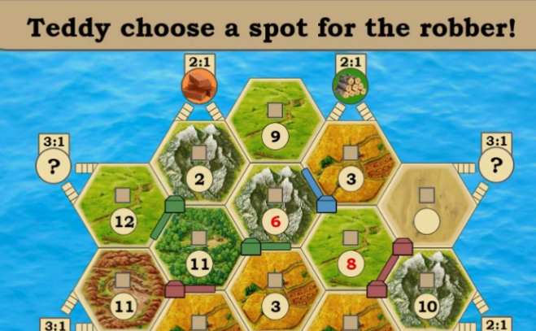
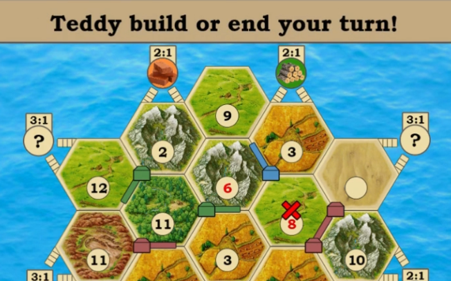
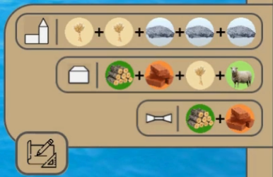

<h1 align="center">🏝️ Catan JavaFX Application</h1>

  A fully playable <b>Catan</b> clone implemented in <b>JavaFX</b> and <b>Scene Builder</b>.  
  Supports <b>2, 3, or 4 local players</b> with save/load functionality, avatars, and full gameplay mechanics.

---

<h2>🛠️ Technologies Used</h2>
<ul>
  <li><b>JavaFX</b> – UI and scene management</li>
  <li><b>Scene Builder</b> – UI design</li>
  <li><b>Java</b> – Game logic and backend</li>
</ul>

---

<h2>✨ Features</h2>
<ul>
  <li>🎮 <b>Local Multiplayer</b> – Play with 2, 3, or 4 players on the same computer</li>
  <li>🏡 <b>Build Villages & Cities</b> – Expand your settlements strategically</li>
  <li>🛣️ <b>Build Roads</b> – Connect your network and aim for the Longest Road bonus</li>
  <li>🏴‍☠️ <b>Robber Mechanics</b> – Place the robber to block resources and steal cards</li>
  <li>📜 <b>Development Cards & Recipes</b> – Follow the official Catan rules</li>
  <li>🖼️ <b>Custom Avatars</b> – Choose names and avatars for each player</li>
  <li>💾 <b>Save & Load Game</b> – Continue your game anytime</li>
</ul>

---

<h2>🖼️ Screenshots</h2>

<h3>ℹ️ About Screen</h3>

   
  <i>Information about the project and credits</i>

<h3>🧑 Player Setup</h3>

   
  <i>Choose players, names, and avatars</i>

<h3>🎲 Gameplay</h3>

   
  <i>Main game screen</i>

<h3>🏡 Building Villages</h3>

  
   
  <i>Screens for building settlements and upgrading to cities</i>

<h3>🛣️ Building Roads</h3>

  
   
  <i>Road building interface and placement preview</i>

<h3>🏴‍☠️ Robber Placement</h3>

  
   
  <i>Placing the robber and stealing a resource</i>

<h3>📜 Recipes</h3>

   
  <i>Rules and resource requirements for building</i>

